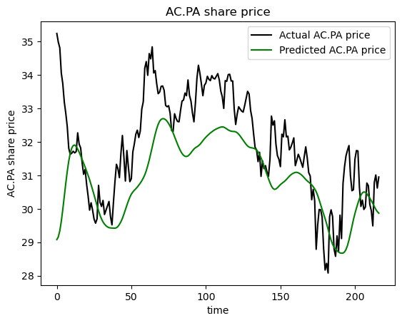

<div align='center'><font size="5" color='#353B47'>Predicting Stock Prices</font></div>
<div align='center'><font size="4" color="#353B47">How to use LSTMs</font></div>
<br>
<hr>

## <div id="summary">Summary</div>

**<font size="2"><a href="#chap1">1. Import libraries</a></font>**
**<br><font size="2"><a href="#chap2">2. Preprocessing</a></font>**
**<br><font size="2"><a href="#chap3">3. Build LSTM model</a></font>**
**<br><font size="2"><a href="#chap4">4. Training</a></font>**
**<br><font size="2"><a href="#chap5">5. Predictions</a></font>**

# Imports


```python
import numpy as np
import pandas as pd

import os
import matplotlib.pyplot as plt
import pandas_datareader as web
import datetime as dt

from sklearn.preprocessing import MinMaxScaler
from tensorflow.keras.models import Sequential
from tensorflow.keras.layers import Dense, Dropout, LSTM
from tensorflow.keras.callbacks import ModelCheckpoint, EarlyStopping
```

    WARNING:tensorflow:From C:\Users\user\AppData\Roaming\Python\Python311\site-packages\keras\src\losses.py:2976: The name tf.losses.sparse_softmax_cross_entropy is deprecated. Please use tf.compat.v1.losses.sparse_softmax_cross_entropy instead.
    
    

# Pre-Processing


```python
# Load csv
no_process_df = pd.read_csv('CAC40_stock_data.csv', parse_dates=['Date'])
no_process_df.tail()
```


<div>
<style scoped>
    .dataframe tbody tr th:only-of-type {
        vertical-align: middle;
    }

    .dataframe tbody tr th {
        vertical-align: top;
    }

    .dataframe thead th {
        text-align: right;
    }
</style>
<table border="1" class="dataframe">
  <thead>
    <tr style="text-align: right;">
      <th></th>
      <th>Date</th>
      <th>Open</th>
      <th>High</th>
      <th>Low</th>
      <th>Close</th>
      <th>Adj Close</th>
      <th>Volume</th>
      <th>Stock</th>
    </tr>
  </thead>
  <tbody>
    <tr>
      <th>27715</th>
      <td>2023-12-06</td>
      <td>12.690</td>
      <td>13.405</td>
      <td>12.585</td>
      <td>13.125</td>
      <td>13.125</td>
      <td>1736300.0</td>
      <td>FR.PA</td>
    </tr>
    <tr>
      <th>27716</th>
      <td>2023-12-07</td>
      <td>12.960</td>
      <td>13.860</td>
      <td>12.740</td>
      <td>13.850</td>
      <td>13.850</td>
      <td>3284833.0</td>
      <td>FR.PA</td>
    </tr>
    <tr>
      <th>27717</th>
      <td>2023-12-08</td>
      <td>13.750</td>
      <td>14.535</td>
      <td>13.705</td>
      <td>14.300</td>
      <td>14.300</td>
      <td>2690703.0</td>
      <td>FR.PA</td>
    </tr>
    <tr>
      <th>27718</th>
      <td>2023-12-11</td>
      <td>14.300</td>
      <td>14.325</td>
      <td>13.900</td>
      <td>14.015</td>
      <td>14.015</td>
      <td>1223682.0</td>
      <td>FR.PA</td>
    </tr>
    <tr>
      <th>27719</th>
      <td>2023-12-12</td>
      <td>14.005</td>
      <td>14.005</td>
      <td>13.240</td>
      <td>13.255</td>
      <td>13.255</td>
      <td>1806853.0</td>
      <td>FR.PA</td>
    </tr>
  </tbody>
</table>
</div>


```python
df = pd.DataFrame()

# Extract relevant columns from the original DataFrame
df['Unnamed: 0'] = no_process_df.index  # Adding an index as 'Unnamed: 0'
df['Name'] = no_process_df['Stock']
df['Date'] = no_process_df['Date']
df['Open'] = no_process_df['Open']
df['Closing_Price'] = no_process_df['Close']
df['Daily_High'] = no_process_df['High']
df['Daily_Low'] = no_process_df['Low']
df['Volume'] = no_process_df['Volume']

# Reverse the order of rows if necessary (optional)
#new_df = new_df[::-1].reset_index(drop=True)


```


```python
df = df[::-1].reset_index(drop=True)

```


```python
df
```


<div>
<style scoped>
    .dataframe tbody tr th:only-of-type {
        vertical-align: middle;
    }

    .dataframe tbody tr th {
        vertical-align: top;
    }

    .dataframe thead th {
        text-align: right;
    }
</style>
<table border="1" class="dataframe">
  <thead>
    <tr style="text-align: right;">
      <th></th>
      <th>Unnamed: 0</th>
      <th>Name</th>
      <th>Date</th>
      <th>Open</th>
      <th>Closing_Price</th>
      <th>Daily_High</th>
      <th>Daily_Low</th>
      <th>Volume</th>
    </tr>
  </thead>
  <tbody>
    <tr>
      <th>0</th>
      <td>27719</td>
      <td>FR.PA</td>
      <td>2023-12-12</td>
      <td>14.005</td>
      <td>13.255000</td>
      <td>14.005000</td>
      <td>13.240000</td>
      <td>1806853.0</td>
    </tr>
    <tr>
      <th>1</th>
      <td>27718</td>
      <td>FR.PA</td>
      <td>2023-12-11</td>
      <td>14.300</td>
      <td>14.015000</td>
      <td>14.325000</td>
      <td>13.900000</td>
      <td>1223682.0</td>
    </tr>
    <tr>
      <th>2</th>
      <td>27717</td>
      <td>FR.PA</td>
      <td>2023-12-08</td>
      <td>13.750</td>
      <td>14.300000</td>
      <td>14.535000</td>
      <td>13.705000</td>
      <td>2690703.0</td>
    </tr>
    <tr>
      <th>3</th>
      <td>27716</td>
      <td>FR.PA</td>
      <td>2023-12-07</td>
      <td>12.960</td>
      <td>13.850000</td>
      <td>13.860000</td>
      <td>12.740000</td>
      <td>3284833.0</td>
    </tr>
    <tr>
      <th>4</th>
      <td>27715</td>
      <td>FR.PA</td>
      <td>2023-12-06</td>
      <td>12.690</td>
      <td>13.125000</td>
      <td>13.405000</td>
      <td>12.585000</td>
      <td>1736300.0</td>
    </tr>
    <tr>
      <th>...</th>
      <td>...</td>
      <td>...</td>
      <td>...</td>
      <td>...</td>
      <td>...</td>
      <td>...</td>
      <td>...</td>
      <td>...</td>
    </tr>
    <tr>
      <th>27715</th>
      <td>4</td>
      <td>AC.PA</td>
      <td>2020-12-18</td>
      <td>29.580</td>
      <td>29.540001</td>
      <td>30.100000</td>
      <td>29.340000</td>
      <td>1033501.0</td>
    </tr>
    <tr>
      <th>27716</th>
      <td>3</td>
      <td>AC.PA</td>
      <td>2020-12-17</td>
      <td>29.750</td>
      <td>29.770000</td>
      <td>30.000000</td>
      <td>29.480000</td>
      <td>677096.0</td>
    </tr>
    <tr>
      <th>27717</th>
      <td>2</td>
      <td>AC.PA</td>
      <td>2020-12-16</td>
      <td>30.230</td>
      <td>29.629999</td>
      <td>30.400000</td>
      <td>29.360001</td>
      <td>650601.0</td>
    </tr>
    <tr>
      <th>27718</th>
      <td>1</td>
      <td>AC.PA</td>
      <td>2020-12-15</td>
      <td>29.430</td>
      <td>29.990000</td>
      <td>30.030001</td>
      <td>29.010000</td>
      <td>1116363.0</td>
    </tr>
    <tr>
      <th>27719</th>
      <td>0</td>
      <td>AC.PA</td>
      <td>2020-12-14</td>
      <td>30.270</td>
      <td>29.480000</td>
      <td>30.360001</td>
      <td>29.420000</td>
      <td>786593.0</td>
    </tr>
  </tbody>
</table>
<p>27720 rows × 8 columns</p>
</div>


```python
COMPANY = 'AC.PA'
START_DATE = dt.datetime.now() - dt.timedelta(days=365*4)
END_DATE = dt.datetime.now()  - dt.timedelta(days=365)

START_DATE_TEST = dt.datetime.now()  - dt.timedelta(days=365)
```


```python
def load_data(company, start, end):
    dataframe = df.copy()
    print("Original DataFrame:")
    print(dataframe.info())

    dataframe = dataframe.loc[dataframe.Name == company, :]
    print(f"Filtered by Company ({company}):")
    print(dataframe.info())

    dataframe = dataframe.loc[(dataframe['Date'] > start) & (dataframe['Date'] < end), :]
    print(f"Filtered by Date Range ({start} to {end}):")
    print(dataframe.info())

    dataframe = dataframe.rename(columns={'Closing_Price': 'Close'})
    return dataframe


data = load_data(company=COMPANY, start=START_DATE, end=END_DATE)
print("Loaded Data:")
print(data.info())

```

    Original DataFrame:
    <class 'pandas.core.frame.DataFrame'>
    RangeIndex: 27720 entries, 0 to 27719
    Data columns (total 8 columns):
     #   Column         Non-Null Count  Dtype         
    ---  ------         --------------  -----         
     0   Unnamed: 0     27720 non-null  int64         
     1   Name           27720 non-null  object        
     2   Date           27720 non-null  datetime64[ns]
     3   Open           27720 non-null  float64       
     4   Closing_Price  27720 non-null  float64       
     5   Daily_High     27720 non-null  float64       
     6   Daily_Low      27720 non-null  float64       
     7   Volume         27720 non-null  float64       
    dtypes: datetime64[ns](1), float64(5), int64(1), object(1)
    memory usage: 1.7+ MB
    None
    Filtered by Company (AC.PA):
    <class 'pandas.core.frame.DataFrame'>
    Int64Index: 770 entries, 26950 to 27719
    Data columns (total 8 columns):
     #   Column         Non-Null Count  Dtype         
    ---  ------         --------------  -----         
     0   Unnamed: 0     770 non-null    int64         
     1   Name           770 non-null    object        
     2   Date           770 non-null    datetime64[ns]
     3   Open           770 non-null    float64       
     4   Closing_Price  770 non-null    float64       
     5   Daily_High     770 non-null    float64       
     6   Daily_Low      770 non-null    float64       
     7   Volume         770 non-null    float64       
    dtypes: datetime64[ns](1), float64(5), int64(1), object(1)
    memory usage: 54.1+ KB
    None
    Filtered by Date Range (2020-02-06 02:38:07.026312 to 2023-02-05 02:38:07.026312):
    <class 'pandas.core.frame.DataFrame'>
    Int64Index: 553 entries, 27167 to 27719
    Data columns (total 8 columns):
     #   Column         Non-Null Count  Dtype         
    ---  ------         --------------  -----         
     0   Unnamed: 0     553 non-null    int64         
     1   Name           553 non-null    object        
     2   Date           553 non-null    datetime64[ns]
     3   Open           553 non-null    float64       
     4   Closing_Price  553 non-null    float64       
     5   Daily_High     553 non-null    float64       
     6   Daily_Low      553 non-null    float64       
     7   Volume         553 non-null    float64       
    dtypes: datetime64[ns](1), float64(5), int64(1), object(1)
    memory usage: 38.9+ KB
    None
    Loaded Data:
    <class 'pandas.core.frame.DataFrame'>
    Int64Index: 553 entries, 27167 to 27719
    Data columns (total 8 columns):
     #   Column      Non-Null Count  Dtype         
    ---  ------      --------------  -----         
     0   Unnamed: 0  553 non-null    int64         
     1   Name        553 non-null    object        
     2   Date        553 non-null    datetime64[ns]
     3   Open        553 non-null    float64       
     4   Close       553 non-null    float64       
     5   Daily_High  553 non-null    float64       
     6   Daily_Low   553 non-null    float64       
     7   Volume      553 non-null    float64       
    dtypes: datetime64[ns](1), float64(5), int64(1), object(1)
    memory usage: 38.9+ KB
    None
    


```python
START_DATE
```


    datetime.datetime(2020, 2, 6, 2, 38, 7, 26312)


```python
print(data.info())

```

    <class 'pandas.core.frame.DataFrame'>
    Int64Index: 553 entries, 27167 to 27719
    Data columns (total 8 columns):
     #   Column      Non-Null Count  Dtype         
    ---  ------      --------------  -----         
     0   Unnamed: 0  553 non-null    int64         
     1   Name        553 non-null    object        
     2   Date        553 non-null    datetime64[ns]
     3   Open        553 non-null    float64       
     4   Close       553 non-null    float64       
     5   Daily_High  553 non-null    float64       
     6   Daily_Low   553 non-null    float64       
     7   Volume      553 non-null    float64       
    dtypes: datetime64[ns](1), float64(5), int64(1), object(1)
    memory usage: 38.9+ KB
    None
    


```python
data
```


<div>
<style scoped>
    .dataframe tbody tr th:only-of-type {
        vertical-align: middle;
    }

    .dataframe tbody tr th {
        vertical-align: top;
    }

    .dataframe thead th {
        text-align: right;
    }
</style>
<table border="1" class="dataframe">
  <thead>
    <tr style="text-align: right;">
      <th></th>
      <th>Unnamed: 0</th>
      <th>Name</th>
      <th>Date</th>
      <th>Open</th>
      <th>Close</th>
      <th>Daily_High</th>
      <th>Daily_Low</th>
      <th>Volume</th>
    </tr>
  </thead>
  <tbody>
    <tr>
      <th>27167</th>
      <td>552</td>
      <td>AC.PA</td>
      <td>2023-02-03</td>
      <td>30.740000</td>
      <td>31.090000</td>
      <td>31.090000</td>
      <td>30.610001</td>
      <td>696597.0</td>
    </tr>
    <tr>
      <th>27168</th>
      <td>551</td>
      <td>AC.PA</td>
      <td>2023-02-02</td>
      <td>30.129999</td>
      <td>30.799999</td>
      <td>30.959999</td>
      <td>30.129999</td>
      <td>790317.0</td>
    </tr>
    <tr>
      <th>27169</th>
      <td>550</td>
      <td>AC.PA</td>
      <td>2023-02-01</td>
      <td>29.860001</td>
      <td>29.920000</td>
      <td>30.299999</td>
      <td>29.840000</td>
      <td>652883.0</td>
    </tr>
    <tr>
      <th>27170</th>
      <td>549</td>
      <td>AC.PA</td>
      <td>2023-01-31</td>
      <td>29.799999</td>
      <td>29.770000</td>
      <td>29.860001</td>
      <td>29.549999</td>
      <td>809918.0</td>
    </tr>
    <tr>
      <th>27171</th>
      <td>548</td>
      <td>AC.PA</td>
      <td>2023-01-30</td>
      <td>29.760000</td>
      <td>29.700001</td>
      <td>29.860001</td>
      <td>29.379999</td>
      <td>549040.0</td>
    </tr>
    <tr>
      <th>...</th>
      <td>...</td>
      <td>...</td>
      <td>...</td>
      <td>...</td>
      <td>...</td>
      <td>...</td>
      <td>...</td>
      <td>...</td>
    </tr>
    <tr>
      <th>27715</th>
      <td>4</td>
      <td>AC.PA</td>
      <td>2020-12-18</td>
      <td>29.580000</td>
      <td>29.540001</td>
      <td>30.100000</td>
      <td>29.340000</td>
      <td>1033501.0</td>
    </tr>
    <tr>
      <th>27716</th>
      <td>3</td>
      <td>AC.PA</td>
      <td>2020-12-17</td>
      <td>29.750000</td>
      <td>29.770000</td>
      <td>30.000000</td>
      <td>29.480000</td>
      <td>677096.0</td>
    </tr>
    <tr>
      <th>27717</th>
      <td>2</td>
      <td>AC.PA</td>
      <td>2020-12-16</td>
      <td>30.230000</td>
      <td>29.629999</td>
      <td>30.400000</td>
      <td>29.360001</td>
      <td>650601.0</td>
    </tr>
    <tr>
      <th>27718</th>
      <td>1</td>
      <td>AC.PA</td>
      <td>2020-12-15</td>
      <td>29.430000</td>
      <td>29.990000</td>
      <td>30.030001</td>
      <td>29.010000</td>
      <td>1116363.0</td>
    </tr>
    <tr>
      <th>27719</th>
      <td>0</td>
      <td>AC.PA</td>
      <td>2020-12-14</td>
      <td>30.270000</td>
      <td>29.480000</td>
      <td>30.360001</td>
      <td>29.420000</td>
      <td>786593.0</td>
    </tr>
  </tbody>
</table>
<p>553 rows × 8 columns</p>
</div>


```python
# Normalize data
scaler = MinMaxScaler(feature_range=(0,1))
scaled_data = scaler.fit_transform(data['Close'].values.reshape(-1,1))

```


```python
# Set the number of days used for prediction
prediction_days = 60

# Initialize empty lists for training data input and output
x_train = []
y_train = []

# Iterate through the scaled data, starting from the prediction_days index
for x in range(prediction_days, len(scaled_data)):
    # Append the previous 'prediction_days' values to x_train
    x_train.append(scaled_data[x - prediction_days:x, 0])
    # Append the current value to y_train
    y_train.append(scaled_data[x, 0])

# Convert the x_train and y_train lists to numpy arrays
x_train, y_train = np.array(x_train), np.array(y_train)

# Reshape x_train to a 3D array with the appropriate dimensions for the LSTM model
x_train = np.reshape(x_train, (x_train.shape[0], x_train.shape[1], 1))

```


```python
x_train
```


    array([[[0.70298412],
            [0.68285914],
            [0.6217905 ],
            ...,
            [0.31020134],
            [0.29840397],
            [0.30464964]],
    
           [[0.68285914],
            [0.6217905 ],
            [0.61138109],
            ...,
            [0.29840397],
            [0.30464964],
            [0.26231789]],
    
           [[0.6217905 ],
            [0.61138109],
            [0.60652337],
            ...,
            [0.30464964],
            [0.26231789],
            [0.22553782]],
    
           ...,
    
           [[0.97779322],
            [0.96391392],
            [0.94517716],
            ...,
            [0.53296325],
            [0.59541998],
            [0.61138109]],
    
           [[0.96391392],
            [0.94517716],
            [0.9729355 ],
            ...,
            [0.59541998],
            [0.61138109],
            [0.60166552]],
    
           [[0.94517716],
            [0.9729355 ],
            [0.95836235],
            ...,
            [0.61138109],
            [0.60166552],
            [0.62664822]]])


# LSTM model


```python
def LSTM_model():

    # Initialize a sequential model
    model = Sequential()

    # Add the first LSTM layer with 50 units, input shape, and return sequences
    model.add(LSTM(units=50, return_sequences=True, input_shape=(x_train.shape[1], 1)))
    # Add dropout to prevent overfitting
    model.add(Dropout(0.2))

    # Add a second LSTM layer with 50 units and return sequences
    model.add(LSTM(units=50, return_sequences=True))
    # Add dropout to prevent overfitting
    model.add(Dropout(0.2))

    # Add a third LSTM layer with 50 units
    model.add(LSTM(units=50))
    # Add dropout to prevent overfitting
    model.add(Dropout(0.2))

    # Add a dense output layer with one unit
    model.add(Dense(units=1))

    return model
```

# Training


```python
model = LSTM_model()
model.summary()
model.compile(
    optimizer='adam', 
    loss='mean_squared_error'
)
```

    WARNING:tensorflow:From C:\Users\user\AppData\Roaming\Python\Python311\site-packages\keras\src\backend.py:873: The name tf.get_default_graph is deprecated. Please use tf.compat.v1.get_default_graph instead.
    
    Model: "sequential"
    _________________________________________________________________
     Layer (type)                Output Shape              Param #   
    =================================================================
     lstm (LSTM)                 (None, 60, 50)            10400     
                                                                     
     dropout (Dropout)           (None, 60, 50)            0         
                                                                     
     lstm_1 (LSTM)               (None, 60, 50)            20200     
                                                                     
     dropout_1 (Dropout)         (None, 60, 50)            0         
                                                                     
     lstm_2 (LSTM)               (None, 50)                20200     
                                                                     
     dropout_2 (Dropout)         (None, 50)                0         
                                                                     
     dense (Dense)               (None, 1)                 51        
                                                                     
    =================================================================
    Total params: 50851 (198.64 KB)
    Trainable params: 50851 (198.64 KB)
    Non-trainable params: 0 (0.00 Byte)
    _________________________________________________________________
    WARNING:tensorflow:From C:\Users\user\AppData\Roaming\Python\Python311\site-packages\keras\src\optimizers\__init__.py:309: The name tf.train.Optimizer is deprecated. Please use tf.compat.v1.train.Optimizer instead.
    
    


```python
# Define callbacks

# Save weights only for best model
checkpointer = ModelCheckpoint(
    filepath = 'weights_best.hdf5', 
    verbose = 2, 
    save_best_only = True
)

model.fit(
    x_train, 
    y_train, 
    epochs=9, 
    batch_size = 32,
    callbacks = [checkpointer],
    validation_split=0.2
)
```

    Epoch 1/9
    WARNING:tensorflow:From C:\Users\user\AppData\Roaming\Python\Python311\site-packages\keras\src\utils\tf_utils.py:492: The name tf.ragged.RaggedTensorValue is deprecated. Please use tf.compat.v1.ragged.RaggedTensorValue instead.
    
    13/13 [==============================] - ETA: 0s - loss: 0.1062
    Epoch 1: val_loss improved from inf to 0.03747, saving model to weights_best.hdf5
    13/13 [==============================] - 6s 145ms/step - loss: 0.1062 - val_loss: 0.0375
    Epoch 2/9
     1/13 [=>............................] - ETA: 0s - loss: 0.0287

    C:\Users\user\AppData\Roaming\Python\Python311\site-packages\keras\src\engine\training.py:3103: UserWarning: You are saving your model as an HDF5 file via `model.save()`. This file format is considered legacy. We recommend using instead the native Keras format, e.g. `model.save('my_model.keras')`.
      saving_api.save_model(
    

    12/13 [==========================>...] - ETA: 0s - loss: 0.0294
    Epoch 2: val_loss improved from 0.03747 to 0.01360, saving model to weights_best.hdf5
    13/13 [==============================] - 1s 56ms/step - loss: 0.0292 - val_loss: 0.0136
    Epoch 3/9
    13/13 [==============================] - ETA: 0s - loss: 0.0229
    Epoch 3: val_loss did not improve from 0.01360
    13/13 [==============================] - 1s 42ms/step - loss: 0.0229 - val_loss: 0.0139
    Epoch 4/9
    13/13 [==============================] - ETA: 0s - loss: 0.0180
    Epoch 4: val_loss improved from 0.01360 to 0.01273, saving model to weights_best.hdf5
    13/13 [==============================] - 1s 53ms/step - loss: 0.0180 - val_loss: 0.0127
    Epoch 5/9
    13/13 [==============================] - ETA: 0s - loss: 0.0224
    Epoch 5: val_loss improved from 0.01273 to 0.01188, saving model to weights_best.hdf5
    13/13 [==============================] - 1s 52ms/step - loss: 0.0224 - val_loss: 0.0119
    Epoch 6/9
    13/13 [==============================] - ETA: 0s - loss: 0.0202
    Epoch 6: val_loss did not improve from 0.01188
    13/13 [==============================] - 1s 42ms/step - loss: 0.0202 - val_loss: 0.0141
    Epoch 7/9
    12/13 [==========================>...] - ETA: 0s - loss: 0.0156
    Epoch 7: val_loss improved from 0.01188 to 0.01176, saving model to weights_best.hdf5
    13/13 [==============================] - 1s 57ms/step - loss: 0.0155 - val_loss: 0.0118
    Epoch 8/9
    13/13 [==============================] - ETA: 0s - loss: 0.0154
    Epoch 8: val_loss improved from 0.01176 to 0.01075, saving model to weights_best.hdf5
    13/13 [==============================] - 1s 46ms/step - loss: 0.0154 - val_loss: 0.0107
    Epoch 9/9
    13/13 [==============================] - ETA: 0s - loss: 0.0144
    Epoch 9: val_loss did not improve from 0.01075
    13/13 [==============================] - 1s 44ms/step - loss: 0.0144 - val_loss: 0.0126
    


    <keras.src.callbacks.History at 0x1ffdc300090>


```python
data
```


<div>
<style scoped>
    .dataframe tbody tr th:only-of-type {
        vertical-align: middle;
    }

    .dataframe tbody tr th {
        vertical-align: top;
    }

    .dataframe thead th {
        text-align: right;
    }
</style>
<table border="1" class="dataframe">
  <thead>
    <tr style="text-align: right;">
      <th></th>
      <th>Unnamed: 0</th>
      <th>Name</th>
      <th>Date</th>
      <th>Open</th>
      <th>Close</th>
      <th>Daily_High</th>
      <th>Daily_Low</th>
      <th>Volume</th>
    </tr>
  </thead>
  <tbody>
    <tr>
      <th>27167</th>
      <td>552</td>
      <td>AC.PA</td>
      <td>2023-02-03</td>
      <td>30.740000</td>
      <td>31.090000</td>
      <td>31.090000</td>
      <td>30.610001</td>
      <td>696597.0</td>
    </tr>
    <tr>
      <th>27168</th>
      <td>551</td>
      <td>AC.PA</td>
      <td>2023-02-02</td>
      <td>30.129999</td>
      <td>30.799999</td>
      <td>30.959999</td>
      <td>30.129999</td>
      <td>790317.0</td>
    </tr>
    <tr>
      <th>27169</th>
      <td>550</td>
      <td>AC.PA</td>
      <td>2023-02-01</td>
      <td>29.860001</td>
      <td>29.920000</td>
      <td>30.299999</td>
      <td>29.840000</td>
      <td>652883.0</td>
    </tr>
    <tr>
      <th>27170</th>
      <td>549</td>
      <td>AC.PA</td>
      <td>2023-01-31</td>
      <td>29.799999</td>
      <td>29.770000</td>
      <td>29.860001</td>
      <td>29.549999</td>
      <td>809918.0</td>
    </tr>
    <tr>
      <th>27171</th>
      <td>548</td>
      <td>AC.PA</td>
      <td>2023-01-30</td>
      <td>29.760000</td>
      <td>29.700001</td>
      <td>29.860001</td>
      <td>29.379999</td>
      <td>549040.0</td>
    </tr>
    <tr>
      <th>...</th>
      <td>...</td>
      <td>...</td>
      <td>...</td>
      <td>...</td>
      <td>...</td>
      <td>...</td>
      <td>...</td>
      <td>...</td>
    </tr>
    <tr>
      <th>27715</th>
      <td>4</td>
      <td>AC.PA</td>
      <td>2020-12-18</td>
      <td>29.580000</td>
      <td>29.540001</td>
      <td>30.100000</td>
      <td>29.340000</td>
      <td>1033501.0</td>
    </tr>
    <tr>
      <th>27716</th>
      <td>3</td>
      <td>AC.PA</td>
      <td>2020-12-17</td>
      <td>29.750000</td>
      <td>29.770000</td>
      <td>30.000000</td>
      <td>29.480000</td>
      <td>677096.0</td>
    </tr>
    <tr>
      <th>27717</th>
      <td>2</td>
      <td>AC.PA</td>
      <td>2020-12-16</td>
      <td>30.230000</td>
      <td>29.629999</td>
      <td>30.400000</td>
      <td>29.360001</td>
      <td>650601.0</td>
    </tr>
    <tr>
      <th>27718</th>
      <td>1</td>
      <td>AC.PA</td>
      <td>2020-12-15</td>
      <td>29.430000</td>
      <td>29.990000</td>
      <td>30.030001</td>
      <td>29.010000</td>
      <td>1116363.0</td>
    </tr>
    <tr>
      <th>27719</th>
      <td>0</td>
      <td>AC.PA</td>
      <td>2020-12-14</td>
      <td>30.270000</td>
      <td>29.480000</td>
      <td>30.360001</td>
      <td>29.420000</td>
      <td>786593.0</td>
    </tr>
  </tbody>
</table>
<p>553 rows × 8 columns</p>
</div>


# Inference 


```python
# Load test data for the specified company and date range
test_data = load_data(
    company=COMPANY,
    start=START_DATE_TEST,
    end=dt.datetime.now()
)

# Extract the actual closing prices from the test data
actual_prices = test_data['Close'].values

# Concatenate the training and test data along the 'Close' column
total_dataset = pd.concat((data['Close'], test_data['Close']), axis=0)

# Extract the relevant portion of the dataset for model inputs
model_inputs = total_dataset[len(total_dataset) - len(test_data) - prediction_days:].values

print(len(total_dataset))
print(len(test_data))
print(prediction_days)
# Reshape the model inputs to a 2D array with a single column
model_inputs = model_inputs.reshape(-1, 1)

# Apply the same scaling used for training data to the model inputs
model_inputs = scaler.transform(model_inputs)

```

    Original DataFrame:
    <class 'pandas.core.frame.DataFrame'>
    RangeIndex: 27720 entries, 0 to 27719
    Data columns (total 8 columns):
     #   Column         Non-Null Count  Dtype         
    ---  ------         --------------  -----         
     0   Unnamed: 0     27720 non-null  int64         
     1   Name           27720 non-null  object        
     2   Date           27720 non-null  datetime64[ns]
     3   Open           27720 non-null  float64       
     4   Closing_Price  27720 non-null  float64       
     5   Daily_High     27720 non-null  float64       
     6   Daily_Low      27720 non-null  float64       
     7   Volume         27720 non-null  float64       
    dtypes: datetime64[ns](1), float64(5), int64(1), object(1)
    memory usage: 1.7+ MB
    None
    Filtered by Company (AC.PA):
    <class 'pandas.core.frame.DataFrame'>
    Int64Index: 770 entries, 26950 to 27719
    Data columns (total 8 columns):
     #   Column         Non-Null Count  Dtype         
    ---  ------         --------------  -----         
     0   Unnamed: 0     770 non-null    int64         
     1   Name           770 non-null    object        
     2   Date           770 non-null    datetime64[ns]
     3   Open           770 non-null    float64       
     4   Closing_Price  770 non-null    float64       
     5   Daily_High     770 non-null    float64       
     6   Daily_Low      770 non-null    float64       
     7   Volume         770 non-null    float64       
    dtypes: datetime64[ns](1), float64(5), int64(1), object(1)
    memory usage: 54.1+ KB
    None
    Filtered by Date Range (2023-02-05 02:38:07.026312 to 2024-02-05 02:41:18.509497):
    <class 'pandas.core.frame.DataFrame'>
    Int64Index: 217 entries, 26950 to 27166
    Data columns (total 8 columns):
     #   Column         Non-Null Count  Dtype         
    ---  ------         --------------  -----         
     0   Unnamed: 0     217 non-null    int64         
     1   Name           217 non-null    object        
     2   Date           217 non-null    datetime64[ns]
     3   Open           217 non-null    float64       
     4   Closing_Price  217 non-null    float64       
     5   Daily_High     217 non-null    float64       
     6   Daily_Low      217 non-null    float64       
     7   Volume         217 non-null    float64       
    dtypes: datetime64[ns](1), float64(5), int64(1), object(1)
    memory usage: 15.3+ KB
    None
    770
    217
    60
    


```python
prediction_days
```


    60


```python
len(model_inputs)
```


    277


```python
# Initialize an empty list for test data input
x_test = []

# Iterate through the model inputs, starting from the prediction_days index
for x in range(prediction_days, len(model_inputs)):
    
    #print(model_inputs[x-prediction_days:x, 0])
    # Append the previous 'prediction_days' values to x_test
    x_test.append(model_inputs[x-prediction_days:x, 0])


    
# Convert the x_test list to a numpy array
x_test = np.array(x_test)
print(x_test)
print("x_test shape: ", x_test.shape)

# Reshape x_test to a 3D array with the appropriate dimensions for the LSTM model
x_test = np.reshape(x_test, (x_test.shape[0], x_test.shape[1], 1))

# Generate price predictions using the LSTM model
predicted_prices = model.predict(x_test)

# Invert the scaling applied to the predicted prices to obtain actual values
predicted_prices = scaler.inverse_transform(predicted_prices)
```

    [[0.9729355  0.95836235 0.91394879 ... 0.60166552 0.62664822 0.59125611]
     [0.95836235 0.91394879 0.95836235 ... 0.62664822 0.59125611 0.99097868]
     [0.91394879 0.95836235 0.97362961 ... 0.59125611 0.99097868 0.9729355 ]
     ...
     [0.77654424 0.77793194 0.74947962 ... 0.62317846 0.59195009 0.6821653 ]
     [0.77793194 0.74947962 0.75503131 ... 0.59195009 0.6821653  0.69743243]
     [0.74947962 0.75503131 0.76405277 ... 0.6821653  0.69743243 0.67036793]]
    x_test shape:  (217, 60)
    7/7 [==============================] - 1s 12ms/step
    


```python
# Plot the actual prices using a black line
plt.plot(actual_prices, color='black', label=f"Actual {COMPANY} price")

# Plot the predicted prices using a green line
plt.plot(predicted_prices, color='green', label=f"Predicted {COMPANY} price")

# Set the title of the plot using the company name
plt.title(f"{COMPANY} share price")

# Set the x-axis label as 'time'
plt.xlabel("time")

# Set the y-axis label using the company name
plt.ylabel(f"{COMPANY} share price")

# Display a legend to differentiate the actual and predicted prices
plt.legend()

# Show the plot on the screen
plt.show()
```


    

    


```python
# Extract the last 'prediction_days' values from the model inputs
real_data = [model_inputs[len(model_inputs) + 1 - prediction_days:len(model_inputs + 1), 0]]

# Convert the real_data list to a numpy array
real_data = np.array(real_data)

# Reshape real_data to a 3D array with the appropriate dimensions for the LSTM model
real_data = np.reshape(real_data, (real_data.shape[0], real_data.shape[1], 1))

# Generate a prediction using the LSTM model with the real_data input
prediction = model.predict(real_data)

# Invert the scaling applied to the prediction to obtain the actual value
prediction = scaler.inverse_transform(prediction)

real_data_vis = scaler.inverse_transform(real_data[0])

real_data_vis[0][0]

# Print the prediction result to the console
print(f"Prediction: {prediction[0][0]}")
print(f"real: {real_data_vis[0][0]}")
```

    1/1 [==============================] - 0s 47ms/step
    Prediction: 29.84441375732422
    real: 31.96999931335449
    

# References

* <a href = 'https://www.kaggle.com/bryanb'>Based on work done by Brynab</a>
* <a href = 'http://colah.github.io/posts/2015-08-Understanding-LSTMs/'>LSTM Explanations</a>
